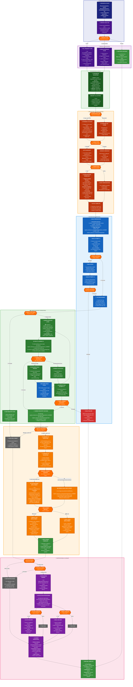

# Jenkins CI/CD Pipeline Flow Diagram

```mermaid
flowchart TD
    subgraph INIT ["🚀 PIPELINE INITIALIZATION"]
        A["🎯 <b>JENKINSFILE ENTRY</b><br/><br/>📋 @Library('jenkins-shared-library@production')<br/>⚙️ BuildDeploy() function call<br/>📝 Load configuration parameters<br/>🔧 Initialize pipeline context"]
        
        A --> B["🔍 <b>BRANCH ANALYSIS</b><br/><br/>🌳 Check branchDefinitions exist<br/>🎯 Get env.BRANCH_NAME<br/>🔍 Identify branch type<br/>📋 Determine target configuration"]
        
        B --> C{{"🔀 <b>BRANCH TYPE</b><br/>What kind of branch?"}}
    end
    
    subgraph BRANCH ["🌳 BRANCH PROCESSING"]
        C -->|"🔄 PR-*"| D["🎯 <b>PULL REQUEST FLOW</b><br/><br/>📍 Get env.CHANGE_TARGET<br/>✅ Validate target branch configured<br/>⚙️ Apply target branch config<br/>🏷️ Set IS_PR_BUILD = true<br/>🚫 Force deploy_option = 'no'<br/>📝 Use PR branch for checkout"]
        
        C -->|"🌟 main/prod/dev"| E["⚙️ <b>REGULAR BRANCH FLOW</b><br/><br/>✅ Verify branch in definitions<br/>📋 Apply branch-specific config<br/>🏷️ Set IS_PR_BUILD = false<br/>⚙️ Keep configured deploy_option<br/>📝 Use specified branch"]
        
        C -->|"❌ other"| F["⏭️ <b>SKIP WITH SUCCESS</b><br/><br/>📝 Log 'branch not configured'<br/>🎭 Create dummy pipeline stage<br/>✅ Set currentBuild.result = SUCCESS<br/>🚪 Exit pipeline gracefully"]
    end
    
    subgraph SETUP ["⚙️ VALIDATION & SETUP"]
        D --> G["🔍 <b>PARAMETER VALIDATION</b><br/><br/>🐳 <b>Docker:</b> project, imageName, gitUrl, branch, gitCreds<br/>☸️ <b>Kubernetes:</b> deployment, namespace, hostIP/sudoUser<br/>🔑 <b>Security:</b> sshCreds, registry credentials<br/>📧 <b>Optional:</b> notifications, configFiles, large_repo"]
        E --> G
        
        G --> H["🖥️ <b>AGENT ALLOCATION</b><br/><br/>🎯 Parse config.docker.agent<br/>🤖 Request Jenkins node<br/>💾 Initialize workspace<br/>📊 Set environment variables"]
    end
    
    subgraph REPO ["📂 REPOSITORY & CONFIGURATION"]
        H --> I{{"📊 <b>REPOSITORY SIZE</b><br/>Large repo handling?"}}
        
        I -->|"✅ large_repo=true"| J["⚡ <b>OPTIMIZED GIT SETUP</b><br/><br/>🔧 Configure Git for large repos:<br/>   • http.postBuffer = 4GB<br/>   • pack.threads = 1<br/>   • core.compression = 9<br/>🔄 Retry logic (2 attempts)<br/>⏰ Extended timeout (20 min)<br/>📊 Shallow clone (depth=20)"]
        
        I -->|"❌ standard"| K["📥 <b>STANDARD GIT CLONE</b><br/><br/>⚙️ Standard Git configuration<br/>📊 Shallow clone (depth=10)<br/>⏰ Standard timeout (5 min)<br/>🎯 Single attempt"]
        
        J --> L{{"🔍 <b>BUILD TYPE</b><br/>PR or regular build?"}}
        K --> L
        
        L -->|"🔄 PR Build"| M["📥 <b>PR CHECKOUT</b><br/><br/>🎯 Use Jenkins default checkout scm<br/>🔄 Checkout PR source branch<br/>🎭 Merge context with target<br/>🔍 Validate PR changes"]
        
        L -->|"🌟 Regular"| N["🌳 <b>BRANCH CHECKOUT</b><br/><br/>📥 Checkout configured branch<br/>🔑 Use scmGit with credentials<br/>🧹 Clean after checkout<br/>✂️ Prune stale branches"]
        
        M --> O{{"📄 <b>CONFIG FILES</b><br/>Download needed?"}}
        N --> O
        
        O -->|"✅ Yes"| P["⬇️ <b>CONFIGURATION DOWNLOAD</b><br/><br/>📝 <b>Support multiple formats:</b><br/>   • String paths: 'file:///path/config.env'<br/>   • Map objects: {path: '...', targetPath: '...'}<br/>🔒 <b>Security validation:</b><br/>   • No null paths, no ../traversal<br/>🎯 <b>Processing:</b><br/>   • Create target directories<br/>   • curl download with error handling<br/>   • Verify successful placement"]
        
        O -->|"❌ No"| Q["⏭️ <b>SKIP CONFIGURATION</b><br/><br/>📝 No configFiles specified<br/>⚙️ Use default configurations<br/>➡️ Continue to build stage"]
        
        P --> R["✅ <b>SETUP COMPLETE</b><br/><br/>✅ Repository checked out<br/>✅ Configuration files ready<br/>✅ Environment prepared<br/>🚀 Ready for Docker build"]
        Q --> R
    end
    
    subgraph DOCKER ["🐳 DOCKER BUILD PROCESS"]
        R --> S["🔨 <b>BUILD PREPARATION</b><br/><br/>📄 <b>Dockerfile detection:</b><br/>   • Custom: config.docker.build_context<br/>   • Default: './Dockerfile'<br/>🔍 Validate Dockerfile exists<br/>🏷️ <b>Image tag setup:</b><br/>   • BUILD_TAG: registry.codezeros.com/project/image:BUILD_NUMBER<br/>   • LATEST_TAG: registry.codezeros.com/project/image:latest"]
        
        S --> T["🎯 <b>BUILD ATTEMPT #1</b><br/><br/>🐳 Execute: docker build --no-cache<br/>📁 Apply custom build context if set<br/>🏷️ Tag with BUILD_NUMBER<br/>📊 Comprehensive build logging"]
        
        T --> U{{"✅ <b>BUILD SUCCESS?</b><br/>Image created?"}}
        
        U -->|"❌ Failed"| V["🔄 <b>BUILD RETRY</b><br/><br/>📝 Log build failure details<br/>⏰ Wait 10 seconds<br/>🎯 Prepare for attempt #2<br/>🧹 Clean failed artifacts"]
        
        U -->|"✅ Success"| W["🏷️ <b>TAG MANAGEMENT</b><br/><br/>🎯 Create latest tag<br/>🔍 Verify tag creation<br/>📊 Compare image IDs<br/>🔄 Retry tagging if needed<br/>✅ Confirm both tags exist"]
        
        V --> X["🎯 <b>BUILD ATTEMPT #2</b><br/><br/>🔄 Recovery build attempt<br/>🐳 Same configuration as #1<br/>📊 Enhanced error logging<br/>⚠️ Final attempt flag"]
        
        X --> Y{{"✅ <b>RETRY SUCCESS?</b><br/>Recovery successful?"}}
        
        Y -->|"❌ Failed"| Z["💥 <b>BUILD FAILURE</b><br/><br/>❌ Both build attempts failed<br/>📝 Log comprehensive error details<br/>🚫 Cannot proceed to registry<br/>💀 PIPELINE TERMINATED"]
        
        Y -->|"✅ Success"| W
    end
    
    subgraph REGISTRY ["🏭 HARBOR REGISTRY OPERATIONS"]
        W --> AA{{"🔍 <b>BUILD TYPE CHECK</b><br/>Should we push?"}}
        
        AA -->|"🔄 PR Build"| BB["⏭️ <b>SKIP REGISTRY PUSH</b><br/><br/>🧪 Build verification only<br/>✅ Docker image built successfully<br/>📋 Ready for code review<br/>🚫 No registry operations"]
        
        AA -->|"🌟 Regular Build"| CC["🔐 <b>HARBOR REGISTRY LOGIN</b><br/><br/>🏭 Connect to registry.codezeros.com<br/>🔑 Use Jenkins credentials (registry.codezeros.com-credentials)<br/>✅ Verify authentication success<br/>📍 <b>HARDCODED:</b> Only Harbor registry supported"]
        
        CC --> DD["📤 <b>PUSH TO HARBOR #1</b><br/><br/>🔍 Verify build tag exists locally<br/>📦 Push to registry.codezeros.com/project/image:BUILD_NUMBER<br/>🔄 Update/create latest tag<br/>📦 Push to registry.codezeros.com/project/image:latest<br/>✅ Verify both pushes complete"]
        
        DD --> EE{{"✅ <b>HARBOR PUSH SUCCESS?</b><br/>Both tags pushed?"}}
        
        EE -->|"✅ Success"| FF["✅ <b>HARBOR REGISTRY SUCCESS</b><br/><br/>📦 Build tag: registry.codezeros.com/project/image:BUILD_NUMBER<br/>📦 Latest tag: registry.codezeros.com/project/image:latest<br/>✅ Both available in Harbor<br/>🚀 Ready for deployment"]
        
        EE -->|"❌ Missing Image"| GG["🛠️ <b>RECOVERY BUILD TRIGGER</b><br/><br/>🔍 Detected missing build tag locally<br/>📝 Log recovery requirement<br/>🔄 Trigger recovery build stage<br/>⚠️ Set recovery flag"]
        
        EE -->|"❌ Network/Auth Error"| HH["🔄 <b>HARBOR PUSH RETRY</b><br/><br/>📝 Log push failure to Harbor<br/>⏰ Wait 10 seconds<br/>🔄 Prepare retry attempt<br/>🧹 Clean partial uploads"]
        
        GG --> II["🔨 <b>RECOVERY BUILD STAGE</b><br/><br/>🛠️ Complete Docker image rebuild<br/>🔄 Full build process with retry logic<br/>🏷️ Recreate both tags<br/>✅ Verify local image availability"]
        
        II --> CC
        
        HH --> JJ["📤 <b>HARBOR PUSH ATTEMPT #2</b><br/><br/>🔄 Final push attempt to Harbor<br/>📦 Push both tags again<br/>📊 Enhanced error reporting<br/>⚠️ Last chance flag"]
        
        JJ --> KK{{"✅ <b>FINAL HARBOR SUCCESS?</b><br/>Push completed?"}}
        
        KK -->|"✅ Success"| FF
        KK -->|"❌ Failed"| Z
    end
    
    subgraph DEPLOY ["☸️ KUBERNETES DEPLOYMENT"]
        FF --> LL{{"🚀 <b>DEPLOY REQUIRED?</b><br/>Should we deploy?"}}
        BB --> MM
        
        LL -->|"❌ deploy_option=no"| MM["⏭️ <b>SKIP DEPLOYMENT</b><br/><br/>⚙️ Deployment disabled in config<br/>📝 Log skip reason<br/>🎯 Continue to notifications<br/>✅ Build pipeline complete"]
        
        LL -->|"✅ deploy_option=yes"| NN["☸️ <b>KUBEDEPLOY EXECUTION</b><br/><br/>📞 Call KubeDeploy.groovy<br/>📦 Pass configuration map<br/>🎯 Transfer control to specialist<br/>⚙️ Kubernetes deployment begins"]
        
        NN --> OO["🔍 <b>KUBEDEPLOY VALIDATION</b><br/><br/>✅ Check required parameters present<br/>🔍 Validate deploy_option = 'yes'<br/>🎯 Confirm deployment method available<br/>📍 Verify cluster connectivity"]
        
        OO --> PP{{"🖼️ <b>IMAGE SOURCE DECISION</b><br/>Use Harbor or custom image?"}}
        
        PP -->|"🎯 useCustomImage=true"| QQ["🌐 <b>CUSTOM IMAGE DEPLOYMENT</b><br/><br/>📍 Use config.kube.imageReference<br/>🔧 <b>Examples:</b><br/>   • ECR: 123456789.dkr.ecr.us-east-1.amazonaws.com/app:v1.0<br/>   • Docker Hub: nginx:latest<br/>   • Other registries: custom.registry.com/image:tag<br/>✅ Validate image accessibility<br/>⚠️ <b>NOTE:</b> This image was NOT built by BuildDeploy"]
        
        PP -->|"❌ useCustomImage=false/undefined"| RR["🏭 <b>HARBOR IMAGE DEPLOYMENT</b><br/><br/>📍 Use image just pushed by BuildDeploy:<br/>   registry.codezeros.com/project/image:BUILD_NUMBER<br/>✅ Use freshly built and pushed image<br/>🎯 Internal Harbor registry optimization<br/>🔒 Secure internal access"]
        
        QQ --> SS{{"🔧 <b>DEPLOYMENT METHOD</b><br/>Local or remote?"}}
        RR --> SS
        
        SS -->|"🌐 Remote"| TT["🔗 <b>REMOTE SSH DEPLOYMENT</b><br/><br/>🔑 sshagent with configured credentials<br/>🌐 SSH to hostIP as sshUser<br/>☸️ kubectl patch deployment in namespace<br/>🔄 kubectl rollout restart deployment<br/>✅ Verify deployment update success"]
        
        SS -->|"🏠 Local"| UU["⚡ <b>LOCAL SUDO DEPLOYMENT</b><br/><br/>👤 sudo -u sudoUser<br/>☸️ kubectl patch deployment in namespace<br/>🔄 kubectl rollout restart deployment<br/>✅ Verify local cluster update"]
        
        TT --> VV["✅ <b>DEPLOYMENT COMPLETE</b><br/><br/>🚀 Application updated in Kubernetes<br/>🔄 Rolling update successful<br/>⚡ New pods running with image<br/>🌐 Service endpoints updated"]
        UU --> VV
    end
    
    subgraph NOTIFY ["📢 NOTIFICATIONS & CLEANUP"]
        VV --> WW{{"📞 <b>NOTIFICATIONS?</b><br/>Should we notify?"}}
        MM --> WW
        
        WW -->|"❌ No config"| XX["⏭️ <b>SKIP NOTIFICATIONS</b><br/><br/>📝 No notification config found<br/>⚙️ Or notifications disabled<br/>🎯 Continue to cleanup<br/>📊 Log notification skip"]
        
        WW -->|"✅ Config exists"| YY{{"🔍 <b>PR BUILD CHECK</b><br/>Notify for PR?"}}
        
        YY -->|"🔄 PR Build"| XX
        YY -->|"🌟 Regular Build"| ZZ["📢 <b>NOTIFICATION SENDER</b><br/><br/>📞 Call NotificationSender.groovy<br/>📊 Pass build status and config<br/>🎨 Generate formatted messages<br/>🚀 Execute notification delivery"]
        
        ZZ --> AAA["🎨 <b>NOTIFICATION PROCESSING</b><br/><br/>📊 Determine build status (SUCCESS/FAILURE/UNSTABLE)<br/>🌈 Select color coding (good/danger/warning)<br/>🔗 Include website_url if configured<br/>📝 Format comprehensive build information"]
        
        AAA --> BBB{{"💬 <b>SLACK ENABLED?</b><br/>Send to Slack?"}}
        AAA --> CCC{{"📧 <b>EMAIL ENABLED?</b><br/>Send email?"}}
        
        BBB -->|"✅ Yes"| DDD["💬 <b>SLACK DELIVERY</b><br/><br/>📢 Send to configured channel<br/>🎨 Color-coded status message<br/>🔗 Include build URL and website<br/>⚡ Real-time team notification"]
        
        CCC -->|"✅ Yes"| EEE["📧 <b>EMAIL DELIVERY</b><br/><br/>👥 Send to recipient distribution list<br/>📎 Attach compressed build logs<br/>🔗 Include build status & website URL<br/>📝 Set reply-to address properly"]
        
        BBB -->|"❌ No"| FFF["⏭️ <b>Skip Slack</b>"]
        CCC -->|"❌ No"| GGG["⏭️ <b>Skip Email</b>"]
        
        DDD --> HHH["🧹 <b>CLEANUP OPERATIONS</b><br/><br/>🐳 <b>Docker cleanup:</b><br/>   • Remove project/imageName images<br/>   • Handle cleanup errors gracefully<br/>🗂️ <b>Workspace cleanup:</b><br/>   • Execute cleanWs()<br/>   • Free up Jenkins disk space<br/>🤖 <b>Agent release:</b><br/>   • Return node to pool"]
        EEE --> HHH
        FFF --> HHH
        GGG --> HHH
        XX --> HHH
        
        HHH --> III["🎉 <b>PIPELINE COMPLETE</b><br/><br/>📊 <b>Final Status:</b> SUCCESS ✅ / FAILURE ❌<br/>📋 <b>Artifacts:</b> All logs preserved<br/>📢 <b>Notifications:</b> Team alerted<br/>🧹 <b>Resources:</b> Cleaned and released<br/>⏰ <b>Duration:</b> Logged and reported"]
    end
    
    F --> III
    Z --> III
    
    %% Enhanced styling with better visual hierarchy
    classDef initStyle fill:#1A237E,color:#ffffff,stroke:#000051,stroke-width:4px,font-weight:bold
    classDef branchStyle fill:#4A148C,color:#ffffff,stroke:#12005e,stroke-width:3px
    classDef setupStyle fill:#1B5E20,color:#ffffff,stroke:#003d00,stroke-width:3px
    classDef repoStyle fill:#BF360C,color:#ffffff,stroke:#870000,stroke-width:3px
    classDef dockerStyle fill:#1565C0,color:#ffffff,stroke:#003c8f,stroke-width:3px
    classDef registryStyle fill:#2E7D32,color:#ffffff,stroke:#005005,stroke-width:3px
    classDef deployStyle fill:#F57C00,color:#ffffff,stroke:#bb4d00,stroke-width:3px
    classDef notifyStyle fill:#7B1FA2,color:#ffffff,stroke:#4a0072,stroke-width:3px
    classDef decisionStyle fill:#FF6F00,color:#ffffff,stroke:#c43e00,stroke-width:4px
    classDef successStyle fill:#388E3C,color:#ffffff,stroke:#00600f,stroke-width:3px
    classDef failureStyle fill:#D32F2F,color:#ffffff,stroke:#9a0007,stroke-width:3px
    classDef skipStyle fill:#616161,color:#ffffff,stroke:#373737,stroke-width:2px
    
    class A initStyle
    class B,D,E branchStyle
    class G,H setupStyle
    class I,J,K,L,M,N,O,P,Q,R repoStyle
    class S,T,V,W,X,II dockerStyle
    class AA,CC,DD,GG,HH,JJ registryStyle
    class LL,NN,OO,QQ,RR,TT,UU,VV deployStyle
    class WW,ZZ,AAA,BBB,CCC,DDD,EEE,HHH notifyStyle
    class C,I,L,O,U,Y,AA,EE,KK,LL,PP,SS,WW,YY,BBB,CCC decisionStyle
    class F,BB,FF,VV,III successStyle
    class Z failureStyle
    class MM,XX,FFF,GGG skipStyle
    
    %% Subgraph styling
    style INIT fill:#E8EAF6,stroke:#3F51B5,stroke-width:3px
    style BRANCH fill:#F3E5F5,stroke:#9C27B0,stroke-width:3px  
    style SETUP fill:#E8F5E8,stroke:#4CAF50,stroke-width:3px
    style REPO fill:#FFF3E0,stroke:#FF9800,stroke-width:3px
    style DOCKER fill:#E3F2FD,stroke:#2196F3,stroke-width:3px
    style REGISTRY fill:#E8F5E8,stroke:#4CAF50,stroke-width:3px
    style DEPLOY fill:#FFF3E0,stroke:#FF9800,stroke-width:3px
    style NOTIFY fill:#FCE4EC,stroke:#E91E63,stroke-width:3px
```