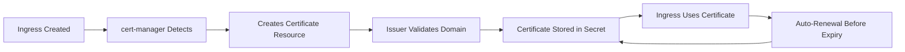

# Kubernetes Certificate Management & Automation Guide

## Table of Contents
1. [Kubernetes Certificate Fundamentals](#kubernetes-certificate-fundamentals)
2. [cert-manager Installation & Setup](#cert-manager-installation--setup)
3. [Ingress Controllers & TLS](#ingress-controllers--tls)
4. [Certificate Automation Strategies](#certificate-automation-strategies)
5. [DNS Challenge Automation](#dns-challenge-automation)
6. [Multi-Cluster & Enterprise Setups](#multi-cluster--enterprise-setups)
7. [CI/CD Integration](#cicd-integration)
8. [Monitoring & Observability](#monitoring--observability)
9. [Troubleshooting & Operations](#troubleshooting--operations)
10. [Best Practices & Security](#best-practices--security)

---

## Kubernetes Certificate Fundamentals

### Core Concepts
- **cert-manager**: Kubernetes add-on to automate certificate management
- **ClusterIssuer**: Cluster-wide certificate issuer (recommended)
- **Issuer**: Namespace-scoped certificate issuer
- **Certificate**: Kubernetes resource representing an X.509 certificate
- **ACME Challenges**: HTTP-01, DNS-01, TLS-ALPN-01 validation methods

### Certificate Lifecycle in Kubernetes


---

## cert-manager Installation & Setup

### 1. Installation Methods

#### Helm Installation (Recommended)
```bash
# Add Helm repository
helm repo add jetstack https://charts.jetstack.io
helm repo update

# Install cert-manager with CRDs
helm install cert-manager jetstack/cert-manager \
  --namespace cert-manager \
  --create-namespace \
  --version v1.14.1 \
  --set installCRDs=true \
  --set global.leaderElection.namespace=cert-manager

# Verify installation
kubectl get pods -n cert-manager
kubectl get crd | grep cert-manager
```

#### Kubectl Installation
```bash
# Install CRDs
kubectl apply -f https://github.com/cert-manager/cert-manager/releases/download/v1.14.1/cert-manager.crds.yaml

# Install cert-manager
kubectl apply -f https://github.com/cert-manager/cert-manager/releases/download/v1.14.1/cert-manager.yaml

# Verify installation
kubectl get pods -n cert-manager
kubectl get apiservice v1beta1.webhook.cert-manager.io
```

#### Operator Installation
```bash
# Install using Operator Lifecycle Manager (OLM)
kubectl create -f https://operatorhub.io/install/cert-manager.yaml

# Verify operator installation
kubectl get csv -n operators
```

### 2. Basic Configuration

#### ClusterIssuer for Let's Encrypt Production
```yaml
apiVersion: cert-manager.io/v1
kind: ClusterIssuer
metadata:
  name: letsencrypt-production
spec:
  acme:
    server: https://acme-v02.api.letsencrypt.org/directory
    email: admin@example.com
    privateKeySecretRef:
      name: letsencrypt-prod-account-key
    solvers:
    - http01:
        ingress:
          class: nginx
          podTemplate:
            spec:
              nodeSelector:
                "kubernetes.io/os": linux
    - dns01:
        cloudflare:
          apiTokenSecretRef:
            name: cloudflare-api-token-secret
            key: api-token
      selector:
        dnsNames:
        - "*.example.com"
        - "example.com"
```

#### ClusterIssuer for Let's Encrypt Staging
```yaml
apiVersion: cert-manager.io/v1
kind: ClusterIssuer
metadata:
  name: letsencrypt-staging
spec:
  acme:
    server: https://acme-staging-v02.api.letsencrypt.org/directory
    email: admin@example.com
    privateKeySecretRef:
      name: letsencrypt-staging-account-key
    solvers:
    - http01:
        ingress:
          class: nginx
    - dns01:
        cloudflare:
          apiTokenSecretRef:
            name: cloudflare-api-token-secret
            key: api-token
```

#### Apply ClusterIssuers
```bash
# Create API token secret for DNS challenge
kubectl create secret generic cloudflare-api-token-secret \
  --from-literal=api-token=your-cloudflare-api-token \
  -n cert-manager

# Apply ClusterIssuers
kubectl apply -f clusterissuer-staging.yaml
kubectl apply -f clusterissuer-production.yaml

# Verify ClusterIssuers
kubectl get clusterissuers
kubectl describe clusterissuer letsencrypt-production
```

---

## Ingress Controllers & TLS

### 1. NGINX Ingress Controller Setup

#### Installation with Helm
```bash
# Add NGINX Ingress Helm repository
helm repo add ingress-nginx https://kubernetes.github.io/ingress-nginx
helm repo update

# Install NGINX Ingress Controller
helm install ingress-nginx ingress-nginx/ingress-nginx \
  --namespace ingress-nginx \
  --create-namespace \
  --set controller.replicaCount=2 \
  --set controller.nodeSelector."kubernetes\.io/os"=linux \
  --set defaultBackend.nodeSelector."kubernetes\.io/os"=linux \
  --set controller.admissionWebhooks.patch.nodeSelector."kubernetes\.io/os"=linux

# Verify installation
kubectl get pods -n ingress-nginx
kubectl get svc -n ingress-nginx
```

#### Get External IP
```bash
# Get external IP for DNS configuration
kubectl get svc -n ingress-nginx ingress-nginx-controller

# For cloud providers, wait for LoadBalancer IP
kubectl get svc -n ingress-nginx -w
```

### 2. Basic Ingress with TLS

#### Simple HTTP to HTTPS Redirect
```yaml
apiVersion: networking.k8s.io/v1
kind: Ingress
metadata:
  name: example-ingress
  namespace: default
  annotations:
    cert-manager.io/cluster-issuer: "letsencrypt-production"
    nginx.ingress.kubernetes.io/ssl-redirect: "true"
    nginx.ingress.kubernetes.io/force-ssl-redirect: "true"
spec:
  ingressClassName: nginx
  tls:
  - hosts:
    - example.com
    - www.example.com
    secretName: example-tls
  rules:
  - host: example.com
    http:
      paths:
      - path: /
        pathType: Prefix
        backend:
          service:
            name: example-service
            port:
              number: 80
  - host: www.example.com
    http:
      paths:
      - path: /
        pathType: Prefix
        backend:
          service:
            name: example-service
            port:
              number: 80
```

#### Wildcard Certificate Ingress
```yaml
apiVersion: networking.k8s.io/v1
kind: Ingress
metadata:
  name: wildcard-ingress
  namespace: default
  annotations:
    cert-manager.io/cluster-issuer: "letsencrypt-production"
    nginx.ingress.kubernetes.io/ssl-redirect: "true"
spec:
  ingressClassName: nginx
  tls:
  - hosts:
    - "*.example.com"
    - example.com
    secretName: wildcard-tls
  rules:
  - host: api.example.com
    http:
      paths:
      - path: /
        pathType: Prefix
        backend:
          service:
            name: api-service
            port:
              number: 80
  - host: app.example.com
    http:
      paths:
      - path: /
        pathType: Prefix
        backend:
          service:
            name: app-service
            port:
              number: 80
```

### 3. Advanced Ingress Configurations

#### Multiple Paths and Services
```yaml
apiVersion: networking.k8s.io/v1
kind: Ingress
metadata:
  name: multi-service-ingress
  annotations:
    cert-manager.io/cluster-issuer: "letsencrypt-production"
    nginx.ingress.kubernetes.io/rewrite-target: /$2
    nginx.ingress.kubernetes.io/ssl-redirect: "true"
spec:
  ingressClassName: nginx
  tls:
  - hosts:
    - platform.example.com
    secretName: platform-tls
  rules:
  - host: platform.example.com
    http:
      paths:
      - path: /api(/|$)(.*)
        pathType: Prefix
        backend:
          service:
            name: api-service
            port:
              number: 3000
      - path: /web(/|$)(.*)
        pathType: Prefix
        backend:
          service:
            name: web-service
            port:
              number: 80
      - path: /admin(/|$)(.*)
        pathType: Prefix
        backend:
          service:
            name: admin-service
            port:
              number: 8080
```

#### IP-based Domain Ingress (nip.io/sslip.io)
```yaml
apiVersion: networking.k8s.io/v1
kind: Ingress
metadata:
  name: ip-domain-ingress
  annotations:
    cert-manager.io/cluster-issuer: "letsencrypt-production"
    nginx.ingress.kubernetes.io/ssl-redirect: "true"
spec:
  ingressClassName: nginx
  tls:
  - hosts:
    - "app.35.244.6.123.nip.io"
    - "api.35.244.6.123.nip.io"
    secretName: ip-domain-tls
  rules:
  - host: app.35.244.6.123.nip.io
    http:
      paths:
      - path: /
        pathType: Prefix
        backend:
          service:
            name: app-service
            port:
              number: 80
  - host: api.35.244.6.123.nip.io
    http:
      paths:
      - path: /
        pathType: Prefix
        backend:
          service:
            name: api-service
            port:
              number: 3000
```

---

## Certificate Automation Strategies

### 1. Automatic Certificate Provisioning

#### Certificate Resource (Explicit)
```yaml
apiVersion: cert-manager.io/v1
kind: Certificate
metadata:
  name: example-com-certificate
  namespace: default
spec:
  secretName: example-com-tls
  issuerRef:
    name: letsencrypt-production
    kind: ClusterIssuer
  dnsNames:
  - example.com
  - www.example.com
  - api.example.com
  usages:
  - digital signature
  - key encipherment
  duration: 2160h  # 90 days
  renewBefore: 720h  # 30 days before expiry
```

#### Ingress-based Automatic Provisioning
```yaml
# cert-manager automatically creates Certificate resources
# when it detects the annotation
apiVersion: networking.k8s.io/v1
kind: Ingress
metadata:
  name: auto-cert-ingress
  annotations:
    cert-manager.io/cluster-issuer: "letsencrypt-production"
    # Optional: specify certificate name
    cert-manager.io/certificate-name: "custom-cert-name"
spec:
  ingressClassName: nginx
  tls:
  - hosts:
    - example.com
    secretName: auto-generated-tls  # cert-manager creates this
  rules:
  - host: example.com
    http:
      paths:
      - path: /
        pathType: Prefix
        backend:
          service:
            name: example-service
            port:
              number: 80
```

### 2. Cross-Namespace Certificate Sharing

#### Certificate in cert-manager namespace
```yaml
apiVersion: cert-manager.io/v1
kind: Certificate
metadata:
  name: shared-wildcard-cert
  namespace: cert-manager
spec:
  secretName: wildcard-certificate
  issuerRef:
    name: letsencrypt-production
    kind: ClusterIssuer
  dnsNames:
  - "*.example.com"
  - example.com
```

#### Copy Certificates with cert-manager-csi-driver
```bash
# Install cert-manager CSI driver
helm repo add jetstack https://charts.jetstack.io
helm install cert-manager-csi-driver jetstack/cert-manager-csi-driver \
  --namespace cert-manager \
  --wait
```

```yaml
# Use CSI driver to mount certificates
apiVersion: v1
kind: Pod
metadata:
  name: example-pod
spec:
  containers:
  - name: app
    image: nginx
    volumeMounts:
    - name: certs
      mountPath: /etc/ssl/certs
      readOnly: true
  volumes:
  - name: certs
    csi:
      driver: csi.cert-manager.io
      readOnly: true
      volumeAttributes:
        csi.cert-manager.io/issuer-name: letsencrypt-production
        csi.cert-manager.io/issuer-kind: ClusterIssuer
        csi.cert-manager.io/dns-names: example.com,www.example.com
```

### 3. Certificate Templates and Policies

#### CertificateRequest Policy
```yaml
apiVersion: policy.cert-manager.io/v1alpha1
kind: CertificateRequestPolicy
metadata:
  name: example-policy
spec:
  allowed:
    commonName:
      value: "*.example.com"
    dnsNames:
      values:
      - "*.example.com"
      - "example.com"
    isCA: false
    usages:
    - "digital signature"
    - "key encipherment"
  selector:
    issuerRef:
      name: "letsencrypt-production"
      kind: "ClusterIssuer"
```

---

## DNS Challenge Automation

### 1. Cloudflare DNS Challenge

#### Create API Token Secret
```bash
# Create Cloudflare API token with Zone:DNS:Edit permissions
kubectl create secret generic cloudflare-api-token-secret \
  --from-literal=api-token=your-cloudflare-api-token \
  -n cert-manager
```

#### ClusterIssuer with Cloudflare
```yaml
apiVersion: cert-manager.io/v1
kind: ClusterIssuer
metadata:
  name: letsencrypt-dns-prod
spec:
  acme:
    server: https://acme-v02.api.letsencrypt.org/directory
    email: admin@example.com
    privateKeySecretRef:
      name: letsencrypt-dns-prod-account-key
    solvers:
    - dns01:
        cloudflare:
          apiTokenSecretRef:
            name: cloudflare-api-token-secret
            key: api-token
      selector:
        dnsZones:
        - "example.com"
        - "subdomain.example.com"
```

### 2. AWS Route53 DNS Challenge

#### IAM Role for Service Account (IRSA)
```yaml
# ServiceAccount for cert-manager
apiVersion: v1
kind: ServiceAccount
metadata:
  name: cert-manager
  namespace: cert-manager
  annotations:
    eks.amazonaws.com/role-arn: arn:aws:iam::ACCOUNT-ID:role/cert-manager-route53
```

#### ClusterIssuer with Route53
```yaml
apiVersion: cert-manager.io/v1
kind: ClusterIssuer
metadata:
  name: letsencrypt-route53-prod
spec:
  acme:
    server: https://acme-v02.api.letsencrypt.org/directory
    email: admin@example.com
    privateKeySecretRef:
      name: letsencrypt-route53-prod-account-key
    solvers:
    - dns01:
        route53:
          region: us-east-1
          # Use IRSA for authentication
          role: arn:aws:iam::ACCOUNT-ID:role/cert-manager-route53
      selector:
        dnsZones:
        - "example.com"
```

#### IAM Policy for Route53
```json
{
  "Version": "2012-10-17",
  "Statement": [
    {
      "Effect": "Allow",
      "Action": "route53:GetChange",
      "Resource": "arn:aws:route53:::change/*"
    },
    {
      "Effect": "Allow",
      "Action": [
        "route53:ChangeResourceRecordSets",
        "route53:ListResourceRecordSets"
      ],
      "Resource": "arn:aws:route53:::hostedzone/*"
    },
    {
      "Effect": "Allow",
      "Action": "route53:ListHostedZonesByName",
      "Resource": "*"
    }
  ]
}
```

### 3. Google Cloud DNS Challenge

#### Service Account Key Secret
```bash
# Create service account key secret
kubectl create secret generic clouddns-dns01-solver-svc-acct \
  --from-file=key.json=path/to/service-account-key.json \
  -n cert-manager
```

#### ClusterIssuer with Google Cloud DNS
```yaml
apiVersion: cert-manager.io/v1
kind: ClusterIssuer
metadata:
  name: letsencrypt-clouddns-prod
spec:
  acme:
    server: https://acme-v02.api.letsencrypt.org/directory
    email: admin@example.com
    privateKeySecretRef:
      name: letsencrypt-clouddns-prod-account-key
    solvers:
    - dns01:
        cloudDNS:
          project: your-project-id
          serviceAccountSecretRef:
            name: clouddns-dns01-solver-svc-acct
            key: key.json
      selector:
        dnsZones:
        - "example.com"
```

### 4. Multiple DNS Provider Setup

#### Multi-Provider ClusterIssuer
```yaml
apiVersion: cert-manager.io/v1
kind: ClusterIssuer
metadata:
  name: letsencrypt-multi-dns
spec:
  acme:
    server: https://acme-v02.api.letsencrypt.org/directory
    email: admin@example.com
    privateKeySecretRef:
      name: letsencrypt-multi-dns-account-key
    solvers:
    # Cloudflare for example.com
    - dns01:
        cloudflare:
          apiTokenSecretRef:
            name: cloudflare-api-token-secret
            key: api-token
      selector:
        dnsZones:
        - "example.com"
        - "*.example.com"
    # Route53 for company.com
    - dns01:
        route53:
          region: us-east-1
          accessKeyID: AKIAI...
          secretAccessKeySecretRef:
            name: route53-secret
            key: secret-access-key
      selector:
        dnsZones:
        - "company.com"
        - "*.company.com"
    # HTTP challenge as fallback
    - http01:
        ingress:
          class: nginx
```

---

## Multi-Cluster & Enterprise Setups

### 1. Multi-Cluster Certificate Management

#### Shared Certificate Authority
```yaml
# Create shared CA issuer
apiVersion: cert-manager.io/v1
kind: ClusterIssuer
metadata:
  name: shared-ca-issuer
spec:
  ca:
    secretName: shared-ca-key-pair
```

#### Cross-Cluster Certificate Replication
```yaml
# External Secrets Operator for certificate sync
apiVersion: external-secrets.io/v1beta1
kind: ExternalSecret
metadata:
  name: shared-certificate
  namespace: default
spec:
  refreshInterval: 1h
  secretStoreRef:
    name: kubernetes-secret-store
    kind: SecretStore
  target:
    name: shared-tls-certificate
    creationPolicy: Owner
  data:
  - secretKey: tls.crt
    remoteRef:
      key: certificates/shared-cert
      property: tls.crt
  - secretKey: tls.key
    remoteRef:
      key: certificates/shared-cert
      property: tls.key
```

### 2. Enterprise Integration

#### HashiCorp Vault Integration
```yaml
apiVersion: cert-manager.io/v1
kind: ClusterIssuer
metadata:
  name: vault-issuer
spec:
  vault:
    server: https://vault.company.com
    path: pki_int/sign/example-dot-com
    auth:
      kubernetes:
        mountPath: /v1/auth/kubernetes
        role: cert-manager
        secretRef:
          name: cert-manager-vault-token
          key: token
```

#### Venafi Integration
```yaml
apiVersion: cert-manager.io/v1
kind: ClusterIssuer
metadata:
  name: venafi-tpp-issuer
spec:
  venafi:
    tpp:
      url: https://tpp.company.com/vedsdk
      credentialsRef:
        name: venafi-tpp-secret
      zone: "DevOps\\Kubernetes"
```

### 3. GitOps Integration

#### ArgoCD Application for cert-manager
```yaml
apiVersion: argoproj.io/v1alpha1
kind: Application
metadata:
  name: cert-manager
  namespace: argocd
spec:
  project: default
  source:
    repoURL: https://charts.jetstack.io
    chart: cert-manager
    targetRevision: v1.14.1
    helm:
      values: |
        installCRDs: true
        global:
          leaderElection:
            namespace: cert-manager
  destination:
    server: https://kubernetes.default.svc
    namespace: cert-manager
  syncPolicy:
    automated:
      prune: true
      selfHeal: true
    syncOptions:
    - CreateNamespace=true
```

#### FluxCD Kustomization
```yaml
apiVersion: kustomize.toolkit.fluxcd.io/v1beta2
kind: Kustomization
metadata:
  name: cert-manager
  namespace: flux-system
spec:
  interval: 10m
  sourceRef:
    kind: GitRepository
    name: fleet-infra
  path: "./clusters/production/cert-manager"
  prune: true
  validation: client
  healthChecks:
  - apiVersion: apps/v1
    kind: Deployment
    name: cert-manager
    namespace: cert-manager
  - apiVersion: apps/v1
    kind: Deployment
    name: cert-manager-webhook
    namespace: cert-manager
```

---

## CI/CD Integration

### 1. Automated Certificate Testing

#### GitHub Actions Workflow
```yaml
name: Certificate Validation
on:
  push:
    paths:
    - 'k8s/certificates/**'
    - 'k8s/ingress/**'

jobs:
  validate-certificates:
    runs-on: ubuntu-latest
    steps:
    - uses: actions/checkout@v3
    
    - name: Setup kubectl
      uses: azure/setup-kubectl@v3
      with:
        version: 'v1.28.0'
    
    - name: Setup Helm
      uses: azure/setup-helm@v3
      with:
        version: 'v3.12.0'
    
    - name: Install cert-manager (staging)
      run: |
        helm repo add jetstack https://charts.jetstack.io
        helm repo update
        helm install cert-manager jetstack/cert-manager \
          --namespace cert-manager \
          --create-namespace \
          --set installCRDs=true \
          --wait
    
    - name: Apply test certificates
      run: |
        kubectl apply -f k8s/certificates/
        kubectl apply -f k8s/ingress/
    
    - name: Wait for certificate readiness
      run: |
        kubectl wait --for=condition=Ready certificate/test-certificate \
          --timeout=300s -n default
    
    - name: Validate certificate
      run: |
        kubectl get certificate test-certificate -o yaml
        kubectl describe certificate test-certificate
```

#### Jenkins Pipeline
```groovy
pipeline {
    agent any
    
    environment {
        KUBECONFIG = credentials('kubeconfig')
        CLOUDFLARE_API_TOKEN = credentials('cloudflare-api-token')
    }
    
    stages {
        stage('Deploy Certificates') {
            steps {
                script {
                    // Apply ClusterIssuer
                    sh '''
                        kubectl apply -f k8s/clusterissuer.yaml
                        kubectl wait --for=condition=Ready clusterissuer/letsencrypt-staging --timeout=60s
                    '''
                    
                    // Apply test certificate
                    sh '''
                        kubectl apply -f k8s/test-certificate.yaml
                        kubectl wait --for=condition=Ready certificate/test-cert --timeout=300s -n default
                    '''
                }
            }
        }
        
        stage('Validate Certificate') {
            steps {
                script {
                    // Check certificate status
                    def certStatus = sh(
                        script: "kubectl get certificate test-cert -o jsonpath='{.status.conditions[0].status}'",
                        returnStdout: true
                    ).trim()
                    
                    if (certStatus != 'True') {
                        error("Certificate validation failed")
                    }
                    
                    // Test HTTPS endpoint
                    sh '''
                        curl -sSf https://test.example.com/health
                    '''
                }
            }
        }
    }
    
    post {
        always {
            // Cleanup test resources
            sh '''
                kubectl delete certificate test-cert --ignore-not-found=true
                kubectl delete ingress test-ingress --ignore-not-found=true
            '''
        }
    }
}
```

### 2. Automated Deployment Scripts

#### Certificate Deployment Script
```bash
#!/bin/bash
# deploy-certificates.sh

set -euo pipefail

NAMESPACE=${1:-default}
DOMAIN=${2:-example.com}
CLUSTER_ISSUER=${3:-letsencrypt-production}

echo "Deploying certificate for $DOMAIN in namespace $NAMESPACE"

# Create namespace if it doesn't exist
kubectl create namespace "$NAMESPACE" --dry-run=client -o yaml | kubectl apply -f -

# Generate certificate manifest
cat <<EOF | kubectl apply -f -
apiVersion: cert-manager.io/v1
kind: Certificate
metadata:
  name: ${DOMAIN//./-}-certificate
  namespace: $NAMESPACE
spec:
  secretName: ${DOMAIN//./-}-tls
  issuerRef:
    name: $CLUSTER_ISSUER
    kind: ClusterIssuer
  dnsNames:
  - $DOMAIN
  - www.$DOMAIN
EOF

# Wait for certificate to be ready
echo "Waiting for certificate to be issued..."
kubectl wait --for=condition=Ready certificate/${DOMAIN//./-}-certificate \
  --timeout=300s -n "$NAMESPACE"

echo "Certificate successfully issued for $DOMAIN"

# Display certificate details
kubectl describe certificate ${DOMAIN//./-}-certificate -n "$NAMESPACE"
```

#### Ingress Deployment with Certificate
```bash
#!/bin/bash
# deploy-ingress-with-tls.sh

DOMAIN=$1
SERVICE_NAME=$2
SERVICE_PORT=$3
NAMESPACE=${4:-default}

if [ $# -lt 3 ]; then
    echo "Usage: $0 <domain> <service-name> <service-port> [namespace]"
    exit 1
fi

# Deploy ingress with automatic certificate
cat <<EOF | kubectl apply -f -
apiVersion: networking.k8s.io/v1
kind: Ingress
metadata:
  name: ${DOMAIN//./-}-ingress
  namespace: $NAMESPACE
  annotations:
    cert-manager.io/cluster-issuer: "letsencrypt-production"
    nginx.ingress.kubernetes.io/ssl-redirect: "true"
    nginx.ingress.kubernetes.io/force-ssl-redirect: "true"
spec:
  ingressClassName: nginx
  tls:
  - hosts:
    - $DOMAIN
    secretName: ${DOMAIN//./-}-tls
  rules:
  - host: $DOMAIN
    http:
      paths:
      - path: /
        pathType: Prefix
        backend:
          service:
            name: $SERVICE_NAME
            port:
              number: $SERVICE_PORT
EOF

echo "Ingress deployed for $DOMAIN -> $SERVICE_NAME:$SERVICE_PORT"
```

---

## Monitoring & Observability

### 1. Prometheus Metrics

#### cert-manager Metrics
```yaml
# ServiceMonitor for cert-manager
apiVersion: monitoring.coreos.com/v1
kind: ServiceMonitor
metadata:
  name: cert-manager-metrics
  namespace: cert-manager
spec:
  selector:
    matchLabels:
      app.kubernetes.io/name: cert-manager
  endpoints:
  - port: tcp-prometheus-servicemonitor
    interval: 30s
    path: /metrics
```

#### Key Metrics to Monitor
```promql
# Certificate expiry time
cert_manager_certificate_expiration_timestamp_seconds

# Certificate readiness
cert_manager_certificate_ready_status

# ACME challenge success rate
rate(cert_manager_acme_client_request_count{status="200"}[5m])

# Certificate renewal rate
rate(cert_manager_certificate_ready_status[1h])
```

### 2. Grafana Dashboard

#### Certificate Monitoring Dashboard
```json
{
  "dashboard": {
    "title": "cert-manager Certificate Monitoring",
    "panels": [
      {
        "title": "Certificate Expiry",
        "type": "graph",
        "targets": [
          {
            "expr": "(cert_manager_certificate_expiration_timestamp_seconds - time()) / 86400",
            "legendFormat": "{{ namespace }}/{{ name }} - Days until expiry"
          }
        ]
      },
      {
        "title": "Certificate Status",
        "type": "stat",
        "targets": [
          {
            "expr": "cert_manager_certificate_ready_status",
            "legendFormat": "{{ namespace }}/{{ name }}"
          }
        ]
      }
    ]
  }
}
```

### 3. Alerting Rules

#### PrometheusRule for cert-manager
```yaml
apiVersion: monitoring.coreos.com/v1
kind: PrometheusRule
metadata:
  name: cert-manager-alerts
  namespace: cert-manager
spec:
  groups:
  - name: cert-manager
    rules:
    - alert: CertificateExpiringSoon
      expr: (cert_manager_certificate_expiration_timestamp_seconds - time()) / 86400 < 7
      for: 1h
      labels:
        severity: warning
      annotations:
        summary: "Certificate {{ $labels.namespace }}/{{ $labels.name }} expires in {{ $value }} days"
        description: "Certificate {{ $labels.namespace }}/{{ $labels.name }} will expire in {{ $value }} days"
    
    - alert: CertificateNotReady
      expr: cert_manager_certificate_ready_status == 0
      for: 5m
      labels:
        severity: critical
      annotations:
        summary: "Certificate {{ $labels.namespace }}/{{ $labels.name }} is not ready"
        description: "Certificate {{ $labels.namespace }}/{{ $labels.name }} has been not ready for more than 5 minutes"
    
    - alert: IssuerNotReady
      expr: cert_manager_cluster_issuer_ready_status == 0
      for: 5m
      labels:
        severity: critical
      annotations:
        summary: "ClusterIssuer {{ $labels.name }} is not ready"
        description: "ClusterIssuer {{ $labels.name }} has been not ready for more than 5 minutes"
```

---

## Troubleshooting & Operations

### 1. Common Issues and Solutions

#### Certificate Stuck in Pending State
```bash
# Check certificate status
kubectl describe certificate example-certificate

# Check certificaterequest
kubectl get certificaterequest
kubectl describe certificaterequest example-certificate-xxx

# Check challenge status
kubectl get challenge
kubectl describe challenge example-certificate-xxx

# Check order status
kubectl get order
kubectl describe order example-certificate-xxx

# Check logs
kubectl logs -n cert-manager deployment/cert-manager
kubectl logs -n cert-manager deployment/cert-manager-webhook
```

#### DNS Challenge Issues
```bash
# Check DNS propagation
dig @8.8.8.8 _acme-challenge.example.com TXT

# Test DNS provider credentials
kubectl get secret cloudflare-api-token-secret -o yaml

# Check ClusterIssuer status
kubectl describe clusterissuer letsencrypt-production

# Manual DNS challenge test
kubectl apply -f - <<EOF
apiVersion: cert-manager.io/v1
kind: Certificate
metadata:
  name: test-dns-challenge
spec:
  secretName: test-dns-tls
  issuerRef:
    name: letsencrypt-staging
    kind: ClusterIssuer
  dnsNames:
  - test.example.com
EOF
```

#### HTTP Challenge Issues
```bash
# Check ingress controller
kubectl get pods -n ingress-nginx
kubectl logs -n ingress-nginx deployment/ingress-nginx-controller

# Test HTTP challenge path
curl -v http://example.com/.well-known/acme-challenge/test

# Check ingress rules
kubectl get ingress -A
kubectl describe ingress example-ingress

# Verify service endpoints
kubectl get endpoints
kubectl describe service example-service
```

### 2. Debugging Commands

#### Certificate Troubleshooting Toolkit
```bash
#!/bin/bash
# cert-debug.sh - Certificate debugging toolkit

CERT_NAME=$1
NAMESPACE=${2:-default}

if [ -z "$CERT_NAME" ]; then
    echo "Usage: $0 <certificate-name> [namespace]"
    exit 1
fi

echo "=== Certificate Status ==="
kubectl get certificate "$CERT_NAME" -n "$NAMESPACE" -o wide

echo -e "\n=== Certificate Description ==="
kubectl describe certificate "$CERT_NAME" -n "$NAMESPACE"

echo -e "\n=== Certificate Requests ==="
kubectl get certificaterequest -n "$NAMESPACE" | grep "$CERT_NAME"

echo -e "\n=== Orders ==="
kubectl get order -n "$NAMESPACE" | grep "$CERT_NAME"

echo -e "\n=== Challenges ==="
kubectl get challenge -n "$NAMESPACE" | grep "$CERT_NAME"

echo -e "\n=== Secret Status ==="
SECRET_NAME=$(kubectl get certificate "$CERT_NAME" -n "$NAMESPACE" -o jsonpath='{.spec.secretName}')
if [ -n "$SECRET_NAME" ]; then
    kubectl get secret "$SECRET_NAME" -n "$NAMESPACE" -o yaml
else
    echo "No secret found"
fi

echo -e "\n=== cert-manager Logs ==="
kubectl logs -n cert-manager deployment/cert-manager --tail=50 | grep -i "$CERT_NAME"
```

#### Validation Script
```bash
#!/bin/bash
# validate-cert-setup.sh

echo "=== Validating cert-manager setup ==="

# Check cert-manager pods
echo "1. Checking cert-manager pods..."
kubectl get pods -n cert-manager
if [ $? -ne 0 ]; then
    echo "❌ cert-manager pods not found"
    exit 1
fi

# Check CRDs
echo -e "\n2. Checking CRDs..."
kubectl get crd | grep cert-manager
if [ $? -ne 0 ]; then
    echo "❌ cert-manager CRDs not found"
    exit 1
fi

# Check ClusterIssuers
echo -e "\n3. Checking ClusterIssuers..."
kubectl get clusterissuers
READY_ISSUERS=$(kubectl get clusterissuers -o jsonpath='{.items[?(@.status.conditions[0].status=="True")].metadata.name}')
if [ -z "$READY_ISSUERS" ]; then
    echo "❌ No ready ClusterIssuers found"
    kubectl describe clusterissuers
    exit 1
fi

# Check ingress controller
echo -e "\n4. Checking ingress controller..."
kubectl get pods -n ingress-nginx
if [ $? -ne 0 ]; then
    echo "⚠️  ingress-nginx not found, checking other ingress controllers..."
    kubectl get ingressclass
fi

# Test certificate creation
echo -e "\n5. Testing certificate creation..."
cat <<EOF | kubectl apply -f -
apiVersion: cert-manager.io/v1
kind: Certificate
metadata:
  name: test-certificate
  namespace: default
spec:
  secretName: test-tls-secret
  issuerRef:
    name: letsencrypt-staging
    kind: ClusterIssuer
  dnsNames:
  - test.example.com
EOF

sleep 10
kubectl describe certificate test-certificate
kubectl delete certificate test-certificate --ignore-not-found=true

echo -e "\n✅ cert-manager validation complete"
```

### 3. Recovery Procedures

#### Certificate Recovery Script
```bash
#!/bin/bash
# recover-certificate.sh

DOMAIN=$1
NAMESPACE=${2:-default}

echo "Recovering certificate for $DOMAIN in namespace $NAMESPACE"

# Delete existing resources
kubectl delete certificate "${DOMAIN//./-}-certificate" -n "$NAMESPACE" --ignore-not-found=true
kubectl delete secret "${DOMAIN//./-}-tls" -n "$NAMESPACE" --ignore-not-found=true

# Clean up any stuck challenges
kubectl delete challenge -n "$NAMESPACE" --all

# Recreate certificate
cat <<EOF | kubectl apply -f -
apiVersion: cert-manager.io/v1
kind: Certificate
metadata:
  name: ${DOMAIN//./-}-certificate
  namespace: $NAMESPACE
spec:
  secretName: ${DOMAIN//./-}-tls
  issuerRef:
    name: letsencrypt-production
    kind: ClusterIssuer
  dnsNames:
  - $DOMAIN
EOF

echo "Certificate recreation initiated. Monitor with:"
echo "kubectl get certificate ${DOMAIN//./-}-certificate -n $NAMESPACE -w"
```

---

## Best Practices & Security

### 1. Security Best Practices

#### RBAC Configuration
```yaml
# ServiceAccount for cert-manager
apiVersion: v1
kind: ServiceAccount
metadata:
  name: cert-manager
  namespace: cert-manager
---
# ClusterRole for cert-manager
apiVersion: rbac.authorization.k8s.io/v1
kind: ClusterRole
metadata:
  name: cert-manager-controller
rules:
- apiGroups: [""]
  resources: ["events"]
  verbs: ["create", "patch"]
- apiGroups: [""]
  resources: ["secrets"]
  verbs: ["get", "list", "watch", "create", "update", "delete"]
- apiGroups: [""]
  resources: ["configmaps"]
  verbs: ["get", "create", "update", "patch"]
- apiGroups: ["cert-manager.io"]
  resources: ["*"]
  verbs: ["*"]
---
# ClusterRoleBinding
apiVersion: rbac.authorization.k8s.io/v1
kind: ClusterRoleBinding
metadata:
  name: cert-manager-controller
roleRef:
  apiGroup: rbac.authorization.k8s.io
  kind: ClusterRole
  name: cert-manager-controller
subjects:
- kind: ServiceAccount
  name: cert-manager
  namespace: cert-manager
```

#### Secret Management
```bash
# Use external secrets for API tokens
kubectl create secret generic dns-provider-credentials \
  --from-literal=api-token="$(vault kv get -field=token secret/dns-provider)" \
  -n cert-manager

# Encrypt secrets at rest
kubectl patch storageclass standard -p '{"metadata":{"annotations":{"storageclass.kubernetes.io/is-default-class":"false"}}}'
kubectl apply -f - <<EOF
apiVersion: storage.k8s.io/v1
kind: StorageClass
metadata:
  name: encrypted-gp2
  annotations:
    storageclass.kubernetes.io/is-default-class: "true"
provisioner: kubernetes.io/aws-ebs
parameters:
  type: gp2
  encrypted: "true"
EOF
```

#### Network Policies
```yaml
# Restrict cert-manager network access
apiVersion: networking.k8s.io/v1
kind: NetworkPolicy
metadata:
  name: cert-manager-netpol
  namespace: cert-manager
spec:
  podSelector:
    matchLabels:
      app.kubernetes.io/name: cert-manager
  policyTypes:
  - Ingress
  - Egress
  ingress:
  - from:
    - namespaceSelector:
        matchLabels:
          name: kube-system
    ports:
    - protocol: TCP
      port: 9402  # metrics
  egress:
  - to: []  # Allow all outbound for ACME API calls
    ports:
    - protocol: TCP
      port: 443
    - protocol: TCP
      port: 53
    - protocol: UDP
      port: 53
```

### 2. Resource Management

#### Resource Limits and Requests
```yaml
# cert-manager with resource limits
apiVersion: apps/v1
kind: Deployment
metadata:
  name: cert-manager
  namespace: cert-manager
spec:
  template:
    spec:
      containers:
      - name: cert-manager
        image: quay.io/jetstack/cert-manager-controller:v1.14.1
        resources:
          requests:
            cpu: 10m
            memory: 32Mi
          limits:
            cpu: 100m
            memory: 128Mi
        securityContext:
          allowPrivilegeEscalation: false
          readOnlyRootFilesystem: true
          runAsNonRoot: true
          capabilities:
            drop:
            - ALL
```

#### Pod Security Standards
```yaml
# Pod Security Standards for cert-manager namespace
apiVersion: v1
kind: Namespace
metadata:
  name: cert-manager
  labels:
    pod-security.kubernetes.io/enforce: restricted
    pod-security.kubernetes.io/audit: restricted
    pod-security.kubernetes.io/warn: restricted
```

### 3. Operational Best Practices

#### Certificate Lifecycle Management
```yaml
# Production certificate configuration
apiVersion: cert-manager.io/v1
kind: Certificate
metadata:
  name: production-certificate
  namespace: production
spec:
  secretName: production-tls
  issuerRef:
    name: letsencrypt-production
    kind: ClusterIssuer
  dnsNames:
  - api.company.com
  - app.company.com
  duration: 2160h    # 90 days
  renewBefore: 720h  # Renew 30 days before expiry
  usages:
  - digital signature
  - key encipherment
  privateKey:
    algorithm: RSA
    size: 2048
  subject:
    organizations:
    - "Company Inc"
    organizationalUnits:
    - "IT Department"
    localities:
    - "San Francisco"
    provinces:
    - "CA"
    countries:
    - "US"
```

#### Backup and Disaster Recovery
```bash
#!/bin/bash
# backup-certificates.sh

BACKUP_DIR="/backup/certificates/$(date +%Y%m%d)"
mkdir -p "$BACKUP_DIR"

# Backup all certificates
kubectl get certificates -A -o yaml > "$BACKUP_DIR/certificates.yaml"

# Backup all secrets containing certificates
kubectl get secrets -A -o yaml | \
grep -A 10 -B 10 "type: kubernetes.io/tls" > "$BACKUP_DIR/tls-secrets.yaml"

# Backup ClusterIssuers
kubectl get clusterissuers -o yaml > "$BACKUP_DIR/clusterissuers.yaml"

# Backup cert-manager configuration
kubectl get configmaps -n cert-manager -o yaml > "$BACKUP_DIR/cert-manager-config.yaml"

echo "Backup completed in $BACKUP_DIR"
```

#### Certificate Rotation Strategy
```yaml
# Automated certificate rotation with external-secrets
apiVersion: external-secrets.io/v1beta1
kind: ExternalSecret
metadata:
  name: rotated-certificate
  namespace: production
spec:
  refreshInterval: 24h  # Check daily for rotation
  secretStoreRef:
    name: vault-backend
    kind: SecretStore
  target:
    name: rotated-tls-secret
    creationPolicy: Owner
    template:
      type: kubernetes.io/tls
  data:
  - secretKey: tls.crt
    remoteRef:
      key: certificates/production
      property: certificate
  - secretKey: tls.key
    remoteRef:
      key: certificates/production
      property: private_key
```

### 4. Performance Optimization

#### cert-manager Tuning
```yaml
# cert-manager performance configuration
apiVersion: v1
kind: ConfigMap
metadata:
  name: cert-manager-config
  namespace: cert-manager
data:
  # Increase concurrent workers
  concurrent-workers: "10"
  # Increase rate limits
  max-certificates-per-hour: "100"
  # Enable leader election
  enable-leader-election: "true"
  # Optimize reconciliation
  certificate-requeue-interval: "1h"
```

#### Horizontal Pod Autoscaling
```yaml
apiVersion: autoscaling/v2
kind: HorizontalPodAutoscaler
metadata:
  name: cert-manager-hpa
  namespace: cert-manager
spec:
  scaleTargetRef:
    apiVersion: apps/v1
    kind: Deployment
    name: cert-manager
  minReplicas: 2
  maxReplicas: 5
  metrics:
  - type: Resource
    resource:
      name: cpu
      target:
        type: Utilization
        averageUtilization: 70
  - type: Resource
    resource:
      name: memory
      target:
        type: Utilization
        averageUtilization: 80
```

---

## Advanced Automation Patterns

### 1. GitOps Certificate Management

#### Kustomize Configuration
```yaml
# kustomization.yaml
apiVersion: kustomize.config.k8s.io/v1beta1
kind: Kustomization

resources:
- clusterissuer.yaml
- certificates/

commonLabels:
  managed-by: gitops

configMapGenerator:
- name: cert-config
  literals:
  - environment=production
  - auto-renew=true

secretGenerator:
- name: dns-provider-credentials
  envs:
  - dns-credentials.env
```

#### ArgoCD Application Set
```yaml
apiVersion: argoproj.io/v1alpha1
kind: ApplicationSet
metadata:
  name: certificate-applications
  namespace: argocd
spec:
  generators:
  - git:
      repoURL: https://github.com/company/k8s-configs
      revision: HEAD
      directories:
      - path: environments/*/certificates
  template:
    metadata:
      name: '{{path.basename}}-certificates'
    spec:
      project: default
      source:
        repoURL: https://github.com/company/k8s-configs
        targetRevision: HEAD
        path: '{{path}}'
      destination:
        server: https://kubernetes.default.svc
        namespace: '{{path.basename}}'
      syncPolicy:
        automated:
          prune: true
          selfHeal: true
```

### 2. Multi-Environment Management

#### Environment-Specific Configurations
```bash
# environments/staging/certificates/kustomization.yaml
apiVersion: kustomize.config.k8s.io/v1beta1
kind: Kustomization

resources:
- ../../../base/certificates

patchesStrategicMerge:
- clusterissuer-staging.yaml

namePrefix: staging-
namespace: staging

# environments/production/certificates/kustomization.yaml
apiVersion: kustomize.config.k8s.io/v1beta1
kind: Kustomization

resources:
- ../../../base/certificates

patchesStrategicMerge:
- clusterissuer-production.yaml

namePrefix: prod-
namespace: production
```

### 3. Dynamic Certificate Provisioning

#### Admission Controller for Auto-TLS
```yaml
apiVersion: admissionregistration.k8s.io/v1
kind: MutatingAdmissionWebhook
metadata:
  name: auto-tls-webhook
webhooks:
- name: ingress.auto-tls.io
  clientConfig:
    service:
      name: auto-tls-webhook-service
      namespace: cert-manager
      path: "/mutate"
  rules:
  - operations: ["CREATE", "UPDATE"]
    apiGroups: ["networking.k8s.io"]
    apiVersions: ["v1"]
    resources: ["ingresses"]
  admissionReviewVersions: ["v1", "v1beta1"]
```

#### Custom Resource for Certificate Templates
```yaml
apiVersion: apiextensions.k8s.io/v1
kind: CustomResourceDefinition
metadata:
  name: certificatetemplates.certs.company.com
spec:
  group: certs.company.com
  versions:
  - name: v1
    served: true
    storage: true
    schema:
      openAPIV3Schema:
        type: object
        properties:
          spec:
            type: object
            properties:
              domains:
                type: array
                items:
                  type: string
              issuer:
                type: string
              duration:
                type: string
          status:
            type: object
  scope: Namespaced
  names:
    plural: certificatetemplates
    singular: certificatetemplate
    kind: CertificateTemplate
```

### 4. Integration with Service Mesh

#### Istio Integration
```yaml
# Gateway with automatic certificate
apiVersion: networking.istio.io/v1beta1
kind: Gateway
metadata:
  name: app-gateway
spec:
  selector:
    istio: ingressgateway
  servers:
  - port:
      number: 443
      name: https
      protocol: HTTPS
    tls:
      mode: SIMPLE
      credentialName: app-tls-secret  # cert-manager managed
    hosts:
    - app.example.com
---
# Certificate for the gateway
apiVersion: cert-manager.io/v1
kind: Certificate
metadata:
  name: app-certificate
spec:
  secretName: app-tls-secret
  issuerRef:
    name: letsencrypt-production
    kind: ClusterIssuer
  dnsNames:
  - app.example.com
```

This comprehensive Kubernetes and automation guide covers all aspects of certificate management in Kubernetes environments, from basic cert-manager setup to advanced GitOps patterns and enterprise integrations. It provides practical examples, troubleshooting procedures, and best practices for production deployments.