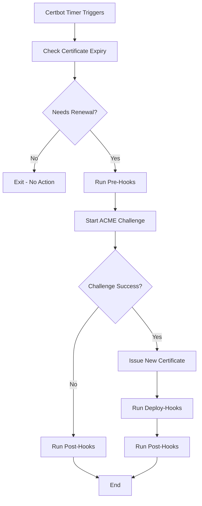

# Certificate Renewal Hooks - Part 1: Core Concepts & Web Services

## Table of Contents
1. [Hook Fundamentals](#hook-fundamentals)
2. [Web Server Hooks](#web-server-hooks)
3. [Reverse Proxy Hooks](#reverse-proxy-hooks)

---

## Hook Fundamentals

### How Certificate Renewal Works


### Hook Types & Execution Flow
- **Pre-hook**: Runs before renewal starts (stop services that block port 80)
- **Deploy-hook**: Runs only after successful certificate deployment (reload services)
- **Post-hook**: Runs after all renewal attempts, regardless of success (cleanup, notifications)

### When Hooks Are Triggered

#### Certificate Renewal Process
```bash
# 1. Certbot checks if renewal is needed (< 30 days to expiry)
# 2. If renewal needed:
#    - Execute ALL pre-hooks in /etc/letsencrypt/renewal-hooks/pre/
#    - Perform ACME challenge (HTTP-01, DNS-01, etc.)
#    - If successful: Execute deploy-hooks for RENEWED domains only
#    - Always execute post-hooks (success or failure)

# Example renewal check
certbot renew --dry-run  # Test what would happen
certbot renew           # Actual renewal
```

#### Hook Execution Environment
- Hooks run as **root** (same user as certbot)
- Each hook is a **separate process**
- Hooks in same directory run in **alphabetical order**
- Failed hooks **don't stop** subsequent hooks in the same category

### Certbot Timer Configuration

#### Check Existing Timer
```bash
# Check if systemd timer is active
systemctl status certbot.timer
systemctl list-timers | grep certbot

# View timer configuration
systemctl cat certbot.timer
```

#### Default Timer Setup
```bash
# Most modern installations include automatic timer
# Location: /etc/systemd/system/certbot.timer

[Unit]
Description=Run certbot twice daily

[Timer]
OnCalendar=*-*-* 00,12:00:00
RandomizedDelaySec=3600
Persistent=true

[Install]
WantedBy=timers.target
```

#### Manual Timer Configuration
```bash
# Enable and start timer
sudo systemctl enable certbot.timer
sudo systemctl start certbot.timer

# View next scheduled run
systemctl list-timers certbot.timer

# Test timer execution
sudo systemctl start certbot.service  # Run once manually
```

#### Custom Timer Schedule
```bash
# Edit timer for different schedule
sudo systemctl edit certbot.timer

# Override with custom schedule (every 6 hours)
[Timer]
OnCalendar=
OnCalendar=*-*-* 00,06,12,18:00:00
RandomizedDelaySec=1800
```

### Hook Directory Structure & Execution
```bash
/etc/letsencrypt/renewal-hooks/
├── pre/                    # Execute before any renewal attempt
│   ├── 01-stop-services.sh    # Runs first (alphabetical order)
│   └── 99-backup-config.sh    # Runs last
├── deploy/                 # Execute only after successful renewal
│   ├── 01-nginx-reload.sh     # Only if certificates were actually renewed
│   ├── 02-postfix-reload.sh   # $RENEWED_DOMAINS will contain domains
│   └── 99-notification.sh     # 
└── post/                   # Execute after all renewal attempts
    ├── 01-cleanup.sh          # Always runs (success or failure)
    └── 99-final-notification.sh
```

### Environment Variables Available to Hooks
```bash
#!/bin/bash
# Available in all hooks:

echo "Renewed domains: $RENEWED_DOMAINS"        # "example.com api.example.com"
echo "Certificate path: $RENEWED_LINEAGE"       # "/etc/letsencrypt/live/example.com"

# Only available in deploy and post hooks:
if [ -n "$RENEWED_DOMAINS" ]; then
    echo "Certificates were actually renewed"
    # Deploy hooks only run when this is true
else
    echo "No certificates were renewed"
    # This means renewal wasn't needed or failed
fi
```

### Hook Creation Best Practices
```bash
#!/bin/bash
# Template for robust hooks

HOOK_NAME="nginx-reload"
LOG_FILE="/var/log/cert-renewal-$HOOK_NAME.log"

log_message() {
    echo "$(date '+%Y-%m-%d %H:%M:%S') [$HOOK_NAME]: $1" | tee -a "$LOG_FILE"
}

# Always check if domains were actually renewed
if [ -z "$RENEWED_DOMAINS" ]; then
    log_message "No domains renewed, exiting"
    exit 0
fi

log_message "Processing domains: $RENEWED_DOMAINS"

# Your hook logic here
for domain in $RENEWED_DOMAINS; do
    log_message "Processing $domain"
    # Domain-specific actions
done

log_message "Hook completed successfully"
```

### Hook Testing & Debugging
```bash
# Test hooks without actual renewal
sudo RENEWED_DOMAINS="test.example.com" \
     RENEWED_LINEAGE="/etc/letsencrypt/live/test.example.com" \
     /etc/letsencrypt/renewal-hooks/deploy/nginx-reload.sh

# Dry run to see what would happen
sudo certbot renew --dry-run

# Force renewal for testing (rate limited!)
sudo certbot renew --force-renewal

# Check hook execution in logs
sudo journalctl -u certbot.service -f
tail -f /var/log/letsencrypt/letsencrypt.log
```

### Timer vs Manual Execution
```bash
# Timer execution (automatic)
# - Runs twice daily by default
# - Only renews certificates that expire soon (< 30 days)
# - Includes randomized delay to distribute load

# Manual execution (testing/troubleshooting)
sudo certbot renew                    # Standard renewal check
sudo certbot renew --force-renewal    # Force renewal (careful with rate limits)
sudo certbot renew --dry-run         # Test what would happen
```

---

## Web Server Hooks

### 1. Nginx Hook Concepts

#### Basic Reload Pattern
```bash
#!/bin/bash
# Basic nginx reload with validation

if nginx -t; then
    systemctl reload nginx
    echo "Nginx reloaded for: $RENEWED_DOMAINS"
else
    echo "ERROR: Nginx config invalid"
    exit 1
fi
```

#### Multi-Instance Pattern
```bash
#!/bin/bash
# Handle multiple nginx instances

INSTANCES=("nginx" "nginx-staging")

for instance in "${INSTANCES[@]}"; do
    if systemctl is-active "$instance"; then
        systemctl reload "$instance"
    fi
done
```

#### Certificate Validation Pattern
```bash
#!/bin/bash
# Validate certificates before reload

validate_cert() {
    local domain=$1
    local cert="/etc/letsencrypt/live/$domain/fullchain.pem"
    
    # Check expiry
    openssl x509 -in "$cert" -noout -checkend 86400
    
    # Check cert/key match
    local cert_hash=$(openssl x509 -noout -modulus -in "$cert" | md5sum)
    local key_hash=$(openssl rsa -noout -modulus -in "${cert%/*}/privkey.pem" | md5sum)
    [ "$cert_hash" = "$key_hash" ]
}

for domain in $RENEWED_DOMAINS; do
    if validate_cert "$domain"; then
        nginx -t && systemctl reload nginx
    fi
done
```

### 2. Apache Hook Concepts

#### Basic Apache Reload
```bash
#!/bin/bash
# Apache reload pattern

if apache2ctl configtest; then
    systemctl reload apache2
    echo "Apache reloaded for: $RENEWED_DOMAINS"
else
    echo "ERROR: Apache config test failed"
    exit 1
fi
```

#### Virtual Host Auto-Configuration
```bash
#!/bin/bash
# Auto-configure SSL virtual hosts

create_ssl_vhost() {
    local domain=$1
    local ssl_conf="/etc/apache2/sites-available/$domain-ssl.conf"
    
    cat > "$ssl_conf" << EOF
<VirtualHost *:443>
    ServerName $domain
    SSLEngine on
    SSLCertificateFile /etc/letsencrypt/live/$domain/fullchain.pem
    SSLCertificateKeyFile /etc/letsencrypt/live/$domain/privkey.pem
    # Include your app config
</VirtualHost>
EOF
    
    a2ensite "$domain-ssl"
}

for domain in $RENEWED_DOMAINS; do
    create_ssl_vhost "$domain"
done

apache2ctl configtest && systemctl reload apache2
```

---

## Reverse Proxy Hooks

### 1. HAProxy Hook Concepts

#### Certificate Combination Pattern
```bash
#!/bin/bash
# HAProxy requires cert+key in single file

CERT_DIR="/etc/haproxy/certs"

for domain in $RENEWED_DOMAINS; do
    cat "/etc/letsencrypt/live/$domain/fullchain.pem" \
        "/etc/letsencrypt/live/$domain/privkey.pem" \
        > "$CERT_DIR/$domain.pem"
    chmod 600 "$CERT_DIR/$domain.pem"
done

haproxy -c -f /etc/haproxy/haproxy.cfg && systemctl reload haproxy
```

#### SNI Configuration Pattern
```bash
#!/bin/bash
# Multiple certificates with SNI

update_haproxy_sni() {
    local config="/etc/haproxy/haproxy.cfg"
    
    # Update bind line with certificate directory
    sed -i 's/bind \*:443 ssl crt.*/bind *:443 ssl crt \/etc\/haproxy\/certs\/' "$config"
}

# Update certificates
for domain in $RENEWED_DOMAINS; do
    combine_cert_and_key "$domain"
done

update_haproxy_sni
systemctl reload haproxy
```

### 2. Traefik Hook Concepts

#### Dynamic Configuration Pattern
```bash
#!/bin/bash
# Traefik auto-reloads dynamic configs

TRAEFIK_DIR="/etc/traefik/dynamic"

for domain in $RENEWED_DOMAINS; do
    cat > "$TRAEFIK_DIR/tls-$domain.yml" << EOF
tls:
  certificates:
    - certFile: "/etc/letsencrypt/live/$domain/fullchain.pem"
      keyFile: "/etc/letsencrypt/live/$domain/privkey.pem"
EOF
done

# Traefik automatically detects file changes
echo "Traefik certificates updated for: $RENEWED_DOMAINS"
```

### 3. Nginx Reverse Proxy Pattern

#### Upstream SSL Configuration
```bash
#!/bin/bash
# Nginx as reverse proxy with SSL termination

update_nginx_ssl() {
    local domain=$1
    local config="/etc/nginx/sites-available/$domain"
    
    # Update certificate paths
    sed -i "s|ssl_certificate .*|ssl_certificate /etc/letsencrypt/live/$domain/fullchain.pem;|" "$config"
    sed -i "s|ssl_certificate_key .*|ssl_certificate_key /etc/letsencrypt/live/$domain/privkey.pem;|" "$config"
}

for domain in $RENEWED_DOMAINS; do
    update_nginx_ssl "$domain"
done

nginx -t && systemctl reload nginx
```

## Advanced Concepts

### 1. Service Health Checking
```bash
#!/bin/bash
# Check service health before/after reload

check_service_health() {
    local service=$1
    local url=$2
    
    if curl -sf "$url" > /dev/null; then
        echo "$service: healthy"
        return 0
    else
        echo "$service: unhealthy"
        return 1
    fi
}

# Check before reload
check_service_health "nginx" "http://localhost/health"
systemctl reload nginx
sleep 2
# Check after reload
check_service_health "nginx" "http://localhost/health"
```

### 2. Rollback on Failure
```bash
#!/bin/bash
# Rollback mechanism

backup_config() {
    cp /etc/nginx/nginx.conf /etc/nginx/nginx.conf.backup
}

restore_config() {
    cp /etc/nginx/nginx.conf.backup /etc/nginx/nginx.conf
    systemctl reload nginx
}

backup_config

if ! nginx -t; then
    restore_config
    echo "ERROR: Config invalid, rolled back"
    exit 1
fi

systemctl reload nginx
```

### 3. Multi-Service Coordination
```bash
#!/bin/bash
# Coordinate multiple services

SERVICES=("nginx" "haproxy" "postfix")

# Stop all services
for service in "${SERVICES[@]}"; do
    systemctl stop "$service"
done

# Update all certificates
update_all_certificates

# Start services in order
for service in "${SERVICES[@]}"; do
    systemctl start "$service"
    sleep 2  # Allow service to stabilize
done
```

This covers the core concepts for web servers and reverse proxies. The focus is on understanding the patterns rather than exhaustive configuration details.